# Mortgage Genie

## How to Use

To use the Mortgage Genie the user first creates and account and Logs in. This account is stored in a Mongo Database and is password encrypted. Once the User is logged into the app, the app recognizes the user as the name he or she used to create the account.
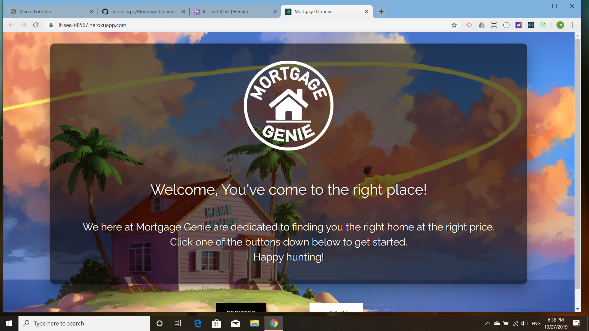
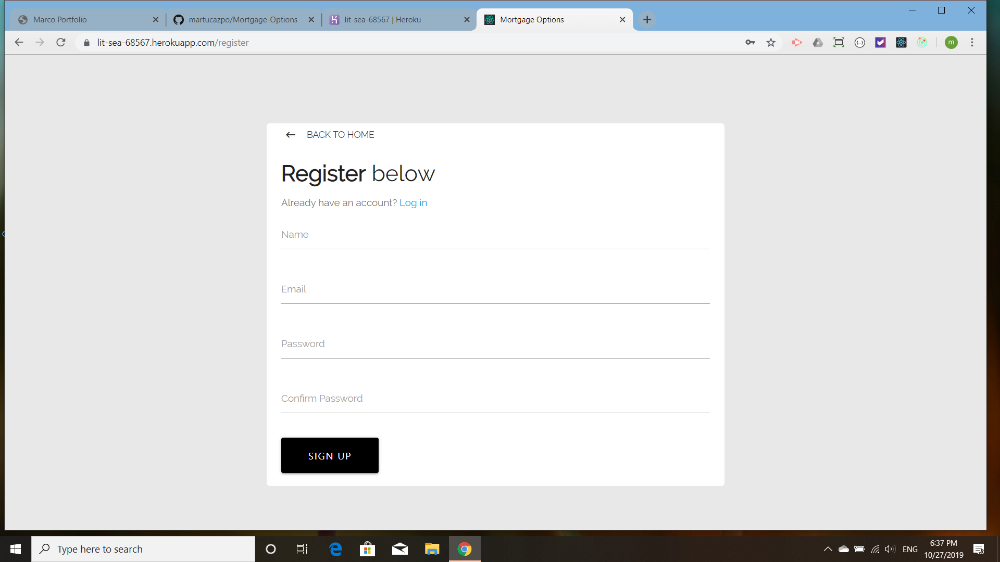
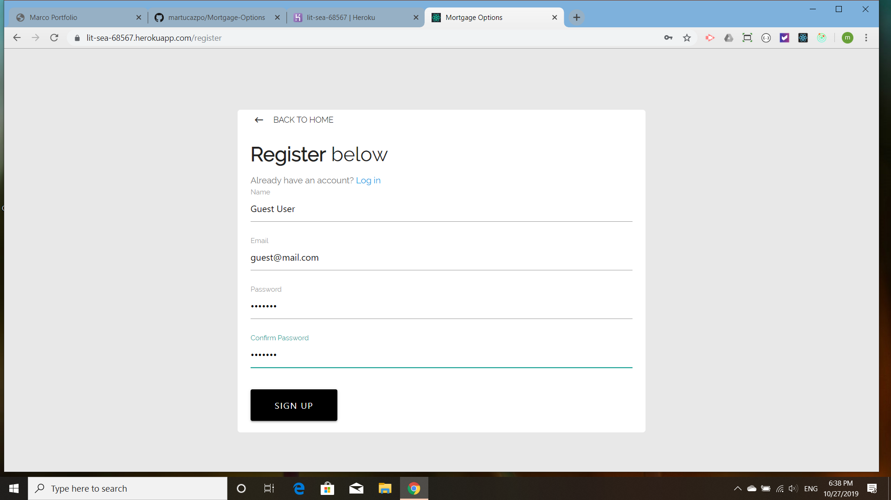
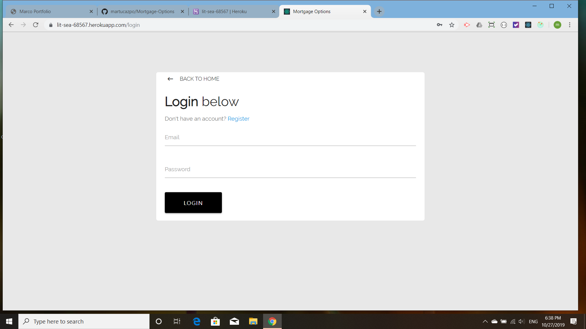
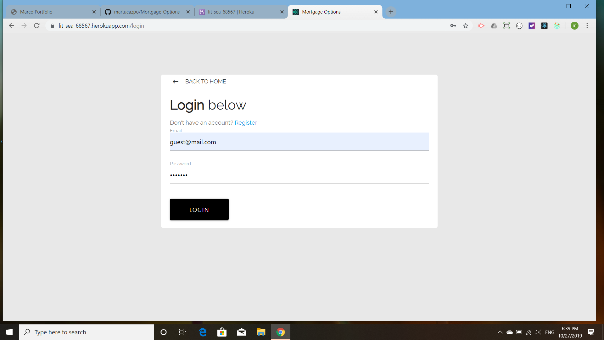
Once the user is registered and signed in he or she fills out a simple form that asks the amount the user wishes to pay a month, the term of the loan and how much downpayment the user wishes to make.
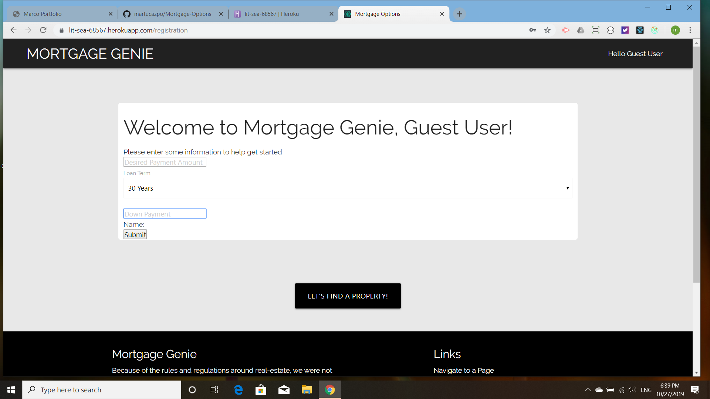
Once the form is filled out it disappears and the user can then edit or delete his or her input.
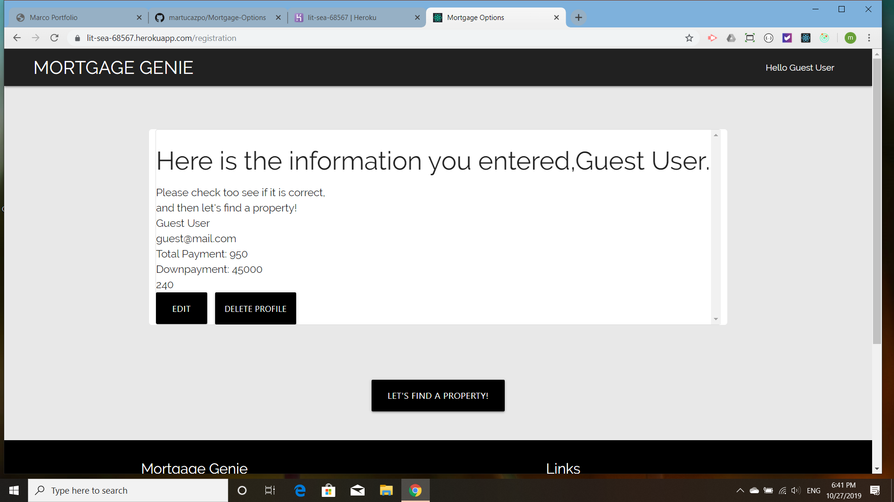
From the registration page the user is directed to the property search page, where, if a full property API were available, he or she would be presented with properties that are in the price range of the amounts entered on the registration page. As this is an API for learning only, there are only ten houses and the prices do not reflect the preferences indicated by the user.
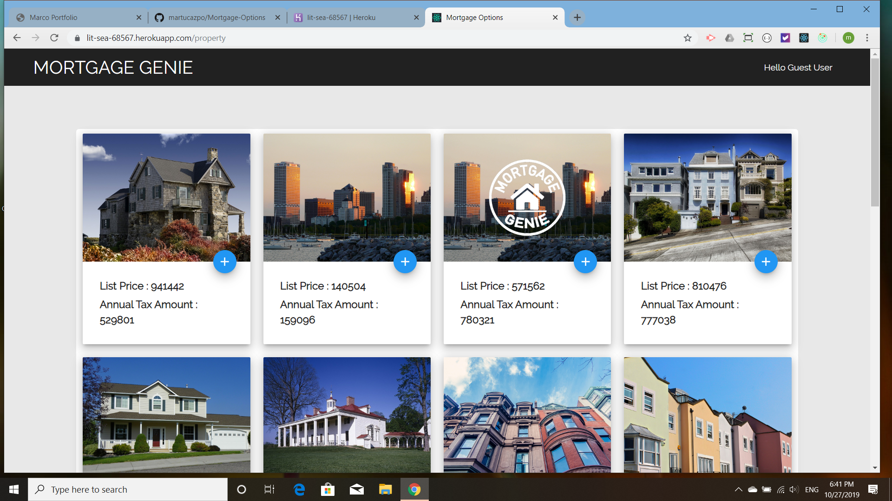
The User can choose properties of interest:
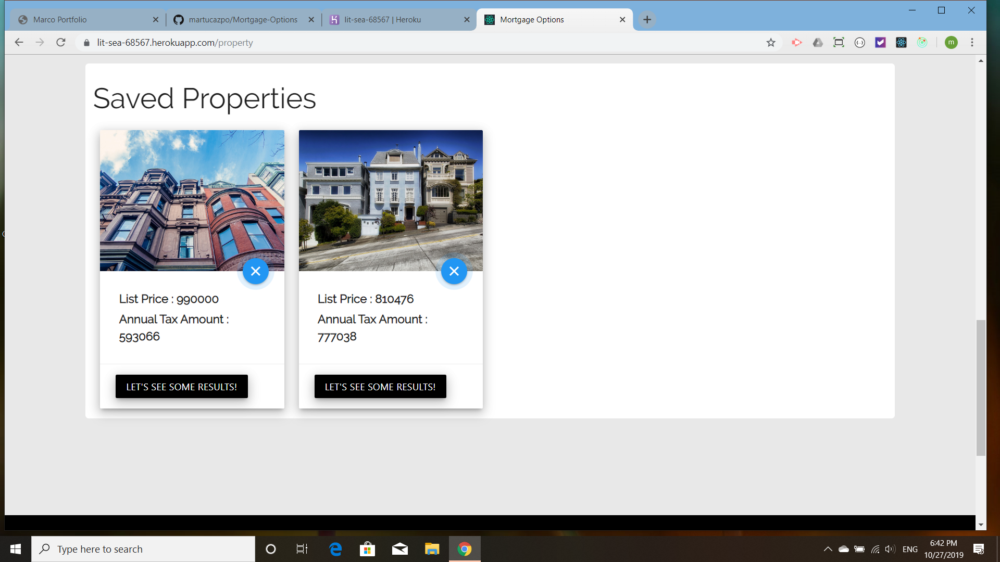
By clicking on the results button the user is taken to the results page where which calculates his or her mortgage options
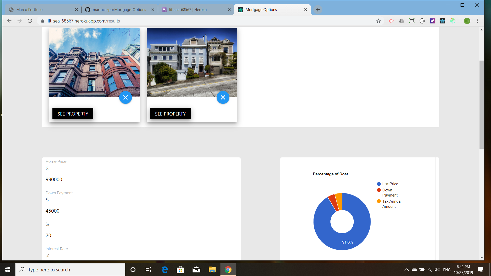
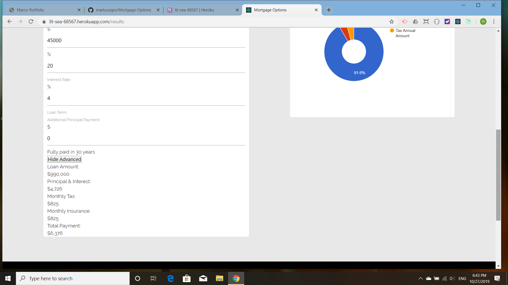
When the user is done, he or she can log out, ending the session.

